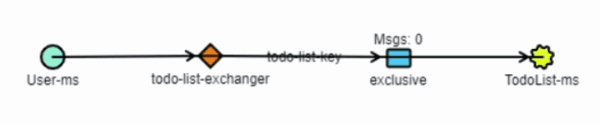

<p align="center">
  <a href="https://www.rabbitmq.com/" target="blank"></a>
</p>

<p align="center">This project is an example of how <a href="http://nodejs.org" target="blank">RabbitMQ</a> can be implemented in a project.</p>

<h2 align="center">Work flow</h2>

<p align="center">1. The user makes a click on the Register button.</p>
<p align="center">2. The application makes HTTP requests to the server.</p>
<p align="center">3. The server creates a new user and sends a message with the user id to generate default TodoList.</p>
<p align="center">4. TodoList-ms receives the message and creates a default TodoList for the user.</p>

<p align="center">

</p>

<p align="center">
  
</p>

## Installation and start **User-ms**

```bash
$ cd User-ms/; npm i; npm start;
```

## Installation and start **TodoList-ms**

```bash
$ cd TodoList-ms/; npm i; npm start;
```
